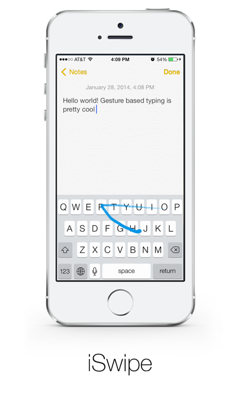
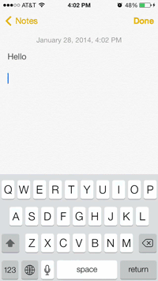

iSwipe is the first gesture-based keyboard for iOS (pre-8.0)

Features
---------
- Uses objc-runtime to hook onto system keyboard methods and extend functionality
- Converts input points into vector angles
- Implements both a dynamic programming and greedy algorithm to match input to words
- Best match is entered, remaining options are ranked in the suggestions box



Building
----------
Requires Xcode and Xcode Command Line Tools.

```sh
git clone 'https://github.com/wyndwarrior/iSwipe.git'
cd iSwipe
git submodule update --init --recursive
make
```

License
--------

Copyright 2014 Yu Xuan Liu. All rights reserved. Content licensed under the [GNU General Public License v3.0](LICENSE)
